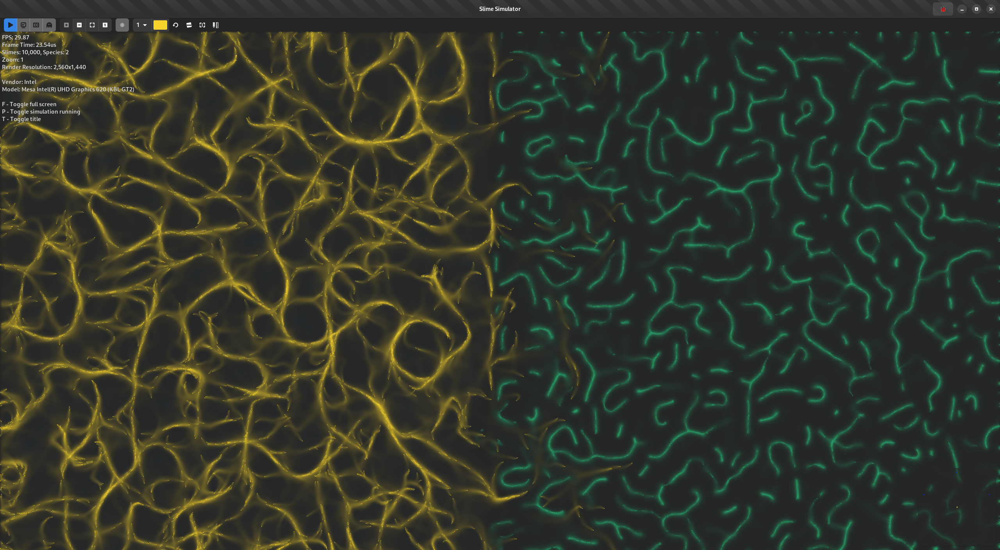

# Slime Simulator

A customizable slime simulation using OpenGL compute shaders to simulate thousands of slime spores/entities in real-time on the GPU.



## GPU vs CPU Rendering

To compare performance between a GPU and CPU-based implementation we can use the `LIBGL_ALWAYS_SOFTWARE` environment variable. Setting it to `1` will force OpenGL to use software rendering on the CPU instead of the GPU.

### Examples

Force the usage of a software-based rendering approach. This uses the CPU to do all GPU-related tasks in software instead of directly on hardware. On Linux, this most likely will result in using [`LLVMpipe`](https://docs.mesa3d.org/drivers/llvmpipe.html).
```
# From inside the `build` directory
LIBGL_ALWAYS_SOFTWARE=1 ./src/sSim
```

Use the default best renderer. In case a hardware-accelerated one like an (i)GPU is available this one will be used.
```
# From inside the `build` directory
LIBGL_ALWAYS_SOFTWARE=0 ./src/sSim
```

### Power Consumption

To compare power consumption between software and hardware rendering on the CPU and its iGPU we can read the [Model-specific register](https://en.wikipedia.org/wiki/Model-specific_register) to get the current CPU package power consumption.
In order to simplify this task we use [`turbostat`](https://www.linux.org/docs/man8/turbostat.html) it's part of the `kernel-tools` package (`sudo dnf install kernel-tools`).

```
sudo turbostat --Summary --quiet --interval 1 --show GFXWatt --show CorWatt --show PkgWatt
```

* `GFXWatt` Watts consumed by the Graphics part of the package -- available only on client processors.
* `CorWatt` Watts consumed by the core part of the package.

## Known Issues

**Q:** Rendering fails/no new images get rendered.<br>
**A:** You are trying to run this on your integrated GPU and rendering a single frame takes too long. Try reducing the number of agents (`INITIAL_NUM_SLIMES`) in `src/sim/Simulation.hpp`. This happens since Linux or in turn, the mesa driver wants to prevent your system from hanging and therefore it kills all GPU jobs that run for more than a specific amount of time without returning. More information:

* Radeon driver: https://docs.mesa3d.org/envvars.html#envvar-RADV_DEBUG
* Intel driver: https://www.intel.com/content/www/us/en/docs/oneapi-hpc-toolkit/get-started-guide-linux/2023-0/before-you-begin.html#HPCHANGCHECK

## Building

### Requirements

#### Fedora

```
sudo dnf install gtkmm4.0-devel libadwaita-devel libcurl-devel g++ clang cmake git
sudo dnf install mesa-libEGL-devel glslc glslang
```

### Compiling

```
git clone https://github.com/COM8/slime_sim.git
cd slime_sim
mkdir build
cd build
cmake ..
cmake --build .
```

### Execution

```
# From inside the `build` directory
./src/sSim
```

### Installing

```
# From inside the `build` directory
sudo cmake --build . --target install
```
